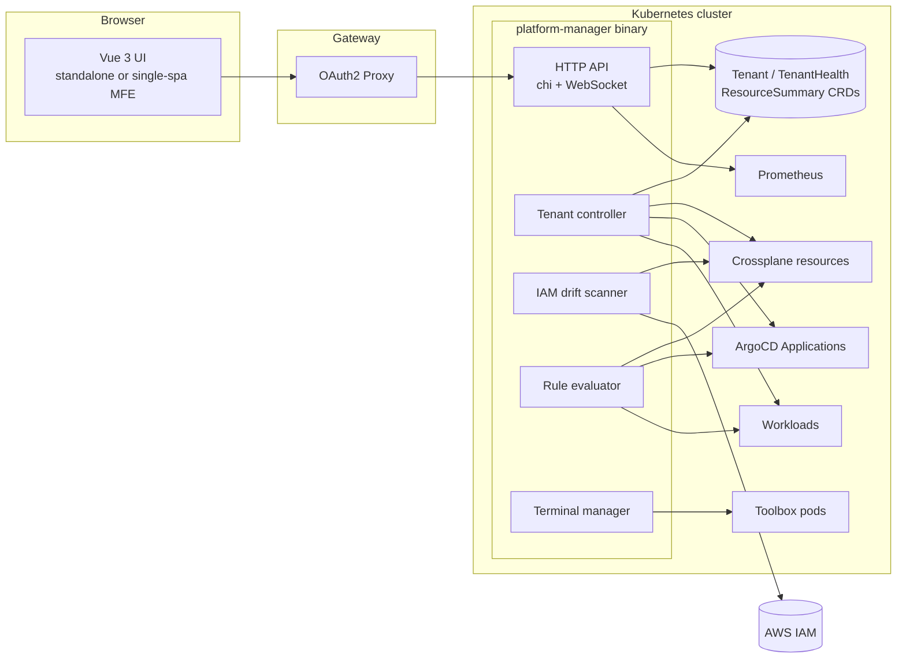

# Platform Manager

A Kubernetes controller and web UI for running a multi-tenant Crossplane platform on AWS. It pulls Crossplane, ArgoCD, Kubernetes workloads, and live AWS IAM state into one place, so you can start at a platform-wide health view and drill down to a single failing resource.

I run a Crossplane-based platform on AWS, and I built this to answer the questions that come up when something breaks. Which tenants are unhealthy right now? Which Crossplane resources are paused or stuck? Has anyone changed an IAM role in the console that Crossplane doesn't know about? Without it, answering those takes a pile of `kubectl get` calls across several namespaces, the ArgoCD UI, and the AWS console.

## What it does

- **Platform and tenant health.** A dashboard rolls up Ready, Failed, Waiting, Unknown, and Paused counts across Crossplane managed resources, Deployments, StatefulSets, DaemonSets, Pods, and ArgoCD Applications. Each tenant gets a Healthy, Degraded, Critical, or Unknown rating, and you can click through to its resources.
- **IAM drift detection.** A background scanner compares each Crossplane-managed IAM Role and Policy against what actually exists in AWS. It reports extra inline or attached policies, missing privileges, policy document and trust policy mismatches, and reconciliation lag. Severity is graded so that "someone added `s3:*` by hand" shows up as critical.
- **Troubleshooting rule engine.** Eleven built-in rules run on a schedule and turn raw status into findings, for example CrashLoopBackOff, ImagePullBackOff, an unhealthy Crossplane provider, a paused resource that is still syncing, ArgoCD sync failures, and high resource usage. Rules implement a small Go interface, so adding one means writing one file.
- **Operational actions.** Sync and refresh ArgoCD apps, pause, unpause, or force-reconcile Crossplane resources, and delete resources. Every action goes through role checks, writes an audit log entry, and records Prometheus metrics.
- **Web terminal.** An xterm.js terminal in the browser, backed by a short-lived toolbox pod with `kubectl`, the AWS CLI, Helm, and the ArgoCD CLI. The pod runs as non-root with all capabilities dropped and a read-only ServiceAccount. Sessions are rate-limited, check the WebSocket Origin header, and end after 10 minutes idle.
- **Role-based access.** Four roles (admin, infra, ml, readonly) map to capabilities such as `argo:sync`, `crossplane:pause`, and `terminal:use`. Identity comes from OAuth2 Proxy headers at the gateway.

## Architecture



The backend is a single Go binary built with Kubebuilder. One controller-runtime manager runs the reconcilers, the background scanners, and the HTTP API, and they all share the manager's informer cache. The frontend is Vue 3 with TypeScript. It builds either as a standalone SPA or as a single-spa micro-frontend that loads into a larger admin portal.

See [docs/architecture.md](docs/architecture.md) for the data model, the reconcile loop, how drift detection works, and the design decisions behind them.

## Tech stack

| Area | Tools |
|------|-------|
| Backend | Go 1.24, Kubebuilder v4, controller-runtime, chi, gorilla/websocket, aws-sdk-go-v2 |
| Frontend | Vue 3, TypeScript, Pinia, Vue Router, Chart.js, xterm.js, single-spa |
| Platform | Kubernetes, Crossplane (Upbound AWS provider), ArgoCD, Prometheus |
| Local dev | kind, LocalStack, Helm, Docker |
| Testing | Ginkgo, Gomega, envtest, kind-based e2e |
| CI | GitHub Actions (lint, unit tests, e2e) |

## Quick start

You need Go 1.24+, Docker, kind, kubectl, Helm, Node 20, and the LocalStack CLI (or Docker).

```sh
# 1. Start LocalStack in a separate terminal. It stands in for AWS IAM.
localstack start

# 2. Create a kind cluster with ArgoCD, Crossplane, and seeded tenants
make dev-up

# 3. Install the CRDs and run the controller + API on :9080
DEV_MODE=true AWS_ENDPOINT=http://localhost:4566 make run-local

# 4. In another terminal, start the UI on http://localhost:9082
make web-install web-dev
```

To see drift detection pick something up, run `make localstack-create-drift`. It attaches an `s3:*` inline policy to a Crossplane-managed role behind Crossplane's back. Then trigger a scan from the IAM Drift page.

[docs/local-development.md](docs/local-development.md) covers the full setup, including the web terminal, seeding failure scenarios, and running the tests.

## Repository layout

```
api/v1alpha1/       CRD types: Tenant, TenantHealth, ResourceSummary, PlatformHealth
cmd/                Entry point that wires the manager, scanners, and API server
internal/
  controller/       Tenant reconciler, Crossplane/Argo watchers, health aggregator, IAM drift scanner
  iam/              AWS IAM client and policy diffing
  rules/            Rule engine and built-in troubleshooting rules
  api/              HTTP handlers and middleware (auth, authz, CORS, audit)
  terminal/         Toolbox pod lifecycle, rate limiting, command recording
  metrics/          Prometheus queries and action metrics
web/                Vue 3 frontend
config/             Kustomize manifests (CRDs, RBAC, manager, frontend)
hack/               kind config, Crossplane/LocalStack setup, seed tenants
test/e2e/           End-to-end tests against a kind cluster
docs/               Architecture, API, security, development, and deployment docs
```

## Documentation

- [Architecture](docs/architecture.md): components, data model, design decisions
- [API reference](docs/api.md): REST and WebSocket endpoints
- [Security](docs/security.md): auth model, terminal hardening, security review results
- [Local development](docs/local-development.md): kind + LocalStack environment, testing
- [Deployment](docs/deployment.md): deploying the controller and the frontend, micro-frontend integration

## Status

This is a working prototype that runs end to end against kind and LocalStack. I ran a security review (`govulncheck`, `npm audit`, and a manual code review) and fixed every critical and high finding in the Go code. The remaining items, mostly dev-only npm advisories from Vue CLI and some hardening work, are listed in [docs/security.md](docs/security.md#known-gaps). Next on the list are moving the frontend from Vue CLI to Vite, detecting orphaned IAM roles that exist in AWS but not in Crossplane (the drift type exists, the scan does not yet), and keeping drift history so you can see trends over time.

## License

MIT. See [LICENSE](LICENSE).
