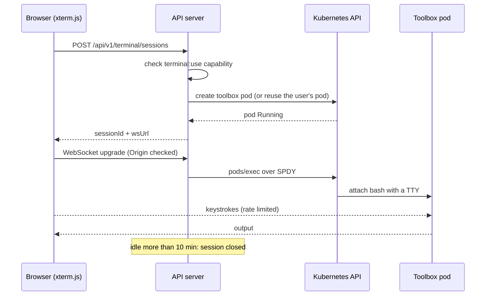

# Architecture

Platform Manager is one Go binary and one Vue app. The binary is a Kubebuilder project. Its controller-runtime manager runs the Tenant reconciler, two background scanners, and an HTTP API server. They all read through the same informer cache, so the API rarely calls the Kubernetes API server directly.

## Components

| Component | Code | What it does |
|-----------|------|--------------|
| Tenant controller | `internal/controller/tenant_controller.go` | Reconciles `Tenant` objects every 30s. Makes sure each tenant has a `TenantHealth`, writes `ResourceSummary` objects for its resources, and updates the tenant's status conditions. |
| Crossplane watcher | `internal/controller/crossplane_watcher.go` | Lists Crossplane managed resources for a tenant and normalizes each one to Ready, Failed, Waiting, Unknown, or Paused. |
| Argo watcher | `internal/controller/argo_watcher.go` | Lists ArgoCD Applications for a tenant and counts them by sync status and health status. |
| Health aggregator | `internal/controller/health_aggregator.go` | Combines Crossplane, workload, Argo, and IAM drift counts into a `TenantHealth` status and a short list of top issues. |
| Resource scanner | `internal/controller/resource_scanner.go` | Creates or updates one `ResourceSummary` per tracked resource, so the UI can list and filter resources without re-scanning the cluster. |
| IAM drift scanner | `internal/controller/iam_drift_scanner.go`, `internal/iam/` | Runs every 5 minutes by default. Compares Crossplane IAM resources with live AWS IAM. |
| Rule evaluator | `internal/controller/rule_evaluator.go`, `internal/rules/` | Runs every 2 minutes by default. Evaluates troubleshooting rules and keeps the current findings in memory. |
| API server | `internal/api/` | chi router on `:9080`. Serves REST endpoints and the terminal WebSocket. |
| Terminal manager | `internal/terminal/` | Creates toolbox pods, tracks sessions, enforces idle timeouts and session limits. |

## Data model

All CRDs live in the `platform.platform.io/v1alpha1` API group.

**Tenant** is the only object a person writes. It says which resources belong to a tenant:

```yaml
apiVersion: platform.platform.io/v1alpha1
kind: Tenant
metadata:
  name: alpha
spec:
  displayName: "Tenant Alpha"
  description: "ML workloads and training pipelines"
  namespaces:
    - tenant-alpha
  labelSelector:
    matchLabels:
      platform.io/tenant: alpha
  argoProjects:
    - tenant-alpha
  environment: dev
```

A resource belongs to a tenant if it is in one of the tenant's namespaces or carries a matching label. Crossplane managed resources are cluster-scoped, so for them the `platform.io/tenant` label is what counts.

**TenantHealth** holds the controller's output for one tenant: resource state counts, an Argo summary, an IAM drift summary, an overall health level, and the top issues. When a Tenant is deleted, a finalizer on it removes the matching TenantHealth.

**ResourceSummary** is a lightweight index entry for one resource: its GVK, name, tenant, category (Crossplane, Kubernetes, ArgoCD, or IAM), and normalized state.

**PlatformHealth** is an optional cluster-wide rollup. If none exists, the API builds the platform view on request by summing every `TenantHealth`.

## Health rules

Each resource is normalized to one of five states. A Crossplane resource is Paused if it has the annotation `crossplane.io/paused: "true"`. Otherwise its `Ready` condition decides its state. If there is no `Ready` condition, `Synced` is used, and synced but not ready counts as Waiting. Workloads are judged by replica readiness and pod phase.

The overall level for a tenant comes from `calculateOverallHealth`:

| Level | Condition |
|-------|-----------|
| Unknown | The tenant has no tracked resources |
| Critical | More than 50% of resources failed, or any ArgoCD app is Degraded |
| Degraded | Any resource failed, or any ArgoCD app is OutOfSync |
| Healthy | More than 80% of resources are Ready |
| Degraded | Anything else |

## IAM drift detection

Crossplane tells you what it *thinks* AWS looks like (`status.atProvider`). That is not the same as what AWS actually has. Someone can attach a policy by hand in the console, and Crossplane will not notice unless the change touches a field it manages. The drift scanner closes that gap.

For each Crossplane `Role` and `Policy` from `iam.aws.upbound.io`, the scanner:

1. Reads the desired state from `spec.forProvider`.
2. Reads Crossplane's view from `status.atProvider`. If it differs from the spec, it reports `reconciliation_lag`.
3. Calls the AWS IAM API for the real role or policy.
4. Parses both policy documents and normalizes them before comparing. Actions and resources can be a string or a list, statement order varies, and JSON key order varies, so a raw string comparison would flag noise.
5. For roles, it also compares the trust policy, and it checks the role's inline and attached managed policies against `spec.forProvider.inlinePolicy` and `spec.forProvider.managedPolicyArns`. Any policy AWS has that the spec does not declare is reported as `extra_privileges`. A declared inline policy that is missing from AWS is reported as `missing_privileges`.

| Drift type | Severity | When |
|------------|----------|------|
| `extra_privileges` | critical | AWS has an inline or attached policy that the spec does not declare |
| `missing_privileges` | critical | The role, policy, trust policy, or an inline policy declared in the spec does not exist in AWS |
| `policy_mismatch` | high | A managed policy document differs from the spec |
| `policy_mismatch` | warning | A role's trust policy differs from the spec |
| `reconciliation_lag` | warning | `status.atProvider` has not caught up with `spec.forProvider` |

Results roll up per tenant and per platform, and they feed into `TenantHealth`. Extra privileges are critical because they are the security problem: something can do more than the spec allows. A missing resource is also critical, because it means Crossplane's view of AWS is wrong.

Two gaps remain. Inline policies are matched by name only, so an inline policy whose document was edited in place is not caught yet. Policies attached through a separate `RolePolicyAttachment` resource are not looked up, so they show up as `extra_privileges`. Declare them in `managedPolicyArns` instead, or treat those findings as expected. An `orphaned_resource` type (in AWS but not managed by Crossplane) is also defined in `internal/iam/types.go`, but the scanner does not produce it yet.

Locally, `AWS_ENDPOINT` points the AWS client at LocalStack. In a real cluster, credentials come from the default AWS chain, normally IRSA on EKS.

## Rule engine

A rule is a Go type that implements this interface:

```go
type Rule interface {
    ID() string
    Name() string
    Description() string
    Severity() Severity
    AppliesTo(resource *unstructured.Unstructured) bool
    Evaluate(ctx RuleContext) ([]Finding, error)
}
```

`internal/rules/builtin/registry.go` lists the built-in rules:

| Area | Rules |
|------|-------|
| Pods | CrashLoopBackOff, ImagePullBackOff, Pending too long |
| Crossplane | IAM resource failed, paused but still syncing, provider unhealthy, stale resource |
| ArgoCD | Sync failed, out of sync |
| Resources | High CPU or memory usage |
| IAM | Extra privileges (reads the `platform.io/iam-drift` annotation) |

Findings are stored in memory, keyed by a stable ID, so the same problem does not show up twice across evaluation runs. A user can mark a finding resolved through the API.

## Web terminal



Each user gets a toolbox pod in the `toolbox-sessions` namespace, and their sessions reuse it. The pod runs the image built from `Dockerfile.toolbox`, which includes `kubectl`, the AWS CLI, Helm, and the ArgoCD CLI. It runs as UID 1000 with no privilege escalation and all capabilities dropped. The pod's `toolbox-session` ServiceAccount can only get, list, and watch. So the terminal is for looking around, and changes still go through the audited action endpoints.

The API server bridges the WebSocket to `pods/exec` with client-go's `remotecommand` SPDY executor. The remote TTY is fixed at 80x24 for now. The server does not handle resize messages yet. A token bucket (100-key burst, refilling at 10 per second) limits input per session. At most 20 sessions run at once.

## Frontend

`web/` is a Vue 3 + TypeScript app with six views: Dashboard, Tenants, Tenant detail, Resources, IAM Drift, and Troubleshooting. A terminal drawer is available on every page. Pinia stores hold platform data and terminal state, and Axios talks to the API.

`src/main.ts` exports single-spa lifecycle functions (`bootstrap`, `mount`, `unmount`). If it detects that no single-spa shell is present, it mounts itself as a normal SPA. `BUILD_MODE=mfe` switches the webpack output to a SystemJS module, so a gateway can load it. [deployment.md](deployment.md) covers both modes.

## Design decisions

**One binary.** The controllers and the HTTP API run in the same process and share the informer cache. That makes it a single Deployment to run and a single RBAC identity to audit. If the API ever needs to scale separately from the controllers, the split would be the API reading from the CRDs, which it already mostly does.

**CRDs as the read model.** The reconciler writes `TenantHealth` and `ResourceSummary`, and the API reads them. Page loads stay cheap no matter how many resources a tenant has, and `kubectl get tenanthealth` works without the UI. Short-lived results such as drift scans and rule findings stay in memory, because they are recomputed every few minutes anyway.

**Summaries, not an ArgoCD clone.** The UI shows sync and health status and offers sync and refresh. For anything deeper it links to the ArgoCD UI. Rebuilding ArgoCD's app tree view would take a lot of work and add little. The value here is cross-tenant context that ArgoCD does not have, such as linking an Argo app to the Crossplane resources and IAM roles of the same tenant.

**Auth stays at the gateway.** The backend does not handle logins. It trusts `X-Auth-Request-*` headers from OAuth2 Proxy and maps groups to roles. That only works if the backend cannot be reached except through the proxy. [security.md](security.md) covers this.

**A pod per user for the terminal, not exec into the manager.** Running shell commands inside the controller process would give every terminal user the controller's permissions. A separate pod with its own read-only ServiceAccount limits what a terminal session can do, and the pod is easy to kill.
