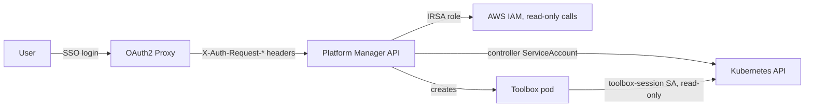

# Security

Platform Manager can pause infrastructure, delete resources, and open a shell inside the cluster, so its access controls matter more than most internal dashboards. This page covers how auth works, what the terminal is allowed to do, the results of the security review, and the gaps that are still open.

## Trust model

The backend does not authenticate users itself. OAuth2 Proxy handles login at the gateway and forwards the user's name, email, and groups as headers. The backend trusts those headers. **So the API must only be reachable through the proxy.** Anyone who can reach the API port directly can send whatever group header they like. In a real deployment, put a NetworkPolicy on the manager that only allows ingress from the gateway. `config/network-policy/` has a starting point for the metrics port.

## Roles and capabilities

The groups header maps to a role (`internal/api/middleware/auth.go`). The first group that matches wins:

| Groups | Role |
|--------|------|
| `platform-admin`, `admin`, `administrators` | admin |
| `platform-infra`, `infra`, `infrastructure` | infra |
| `platform-ml`, `ml`, `machine-learning` | ml |
| anything else, or no headers | readonly |

Each role grants a fixed set of capabilities (`internal/api/middleware/authz.go`):

| Capability | admin | infra | ml | readonly |
|------------|:-----:|:-----:|:--:|:--------:|
| Read everything | yes | yes | yes | yes |
| `argo:refresh` | yes | yes | yes | |
| `argo:sync` | yes | yes | | |
| `crossplane:pause` (pause and unpause) | yes | yes | | |
| `crossplane:reconcile` | yes | yes | | |
| `terminal:use` | yes | yes | | |
| `resource:delete` | yes | | | |

The `RequireCapability` middleware enforces these server-side. The UI also hides buttons the user cannot use, but that is only convenience. The server check is what counts.

Every action that passes authorization gets an audit log entry with the user, role, action, resource, and outcome. Denials increment `platform_manager_auth_denials_total`.

## Development mode

`DEV_MODE=true` relaxes three checks so you can work locally without an SSO setup:

- The `X-Dev-Role` header sets the role directly. Only the four real role names are accepted.
- CORS allows any origin.
- The terminal WebSocket accepts any `Origin`.

The manager logs a warning at startup when the terminal runs in dev mode. Without `DEV_MODE`, `X-Dev-Role` is ignored and requests without proxy headers are read-only. Never set `DEV_MODE` in a shared environment.

## Web terminal

A browser shell into the cluster is the riskiest feature here, so it has several layers:

| Layer | Control |
|-------|---------|
| Feature flag | Off unless the manager starts with `--enable-terminal` |
| Authorization | Creating a session requires `terminal:use` (admin or infra) |
| Isolation | Commands run in a separate toolbox pod, never in the manager process |
| Pod security | UID 1000, `runAsNonRoot`, `allowPrivilegeEscalation: false`, all Linux capabilities dropped, CPU and memory limits |
| Cluster access | The `toolbox-session` ServiceAccount can only get, list, and watch pods, workloads, Crossplane, ArgoCD, and Platform Manager resources. It cannot read Secrets. This RBAC is currently created by `helper-scripts/setup-phase6-terminal.sh` and is not yet part of `config/`. |
| WebSocket | `Origin` must be in `TERMINAL_ALLOWED_ORIGINS`, which blocks cross-site WebSocket hijacking |
| Abuse limits | Token-bucket input limit (100 burst, 10/s), at most 20 concurrent sessions, 10-minute idle timeout |
| Audit | Session start is logged with the user, session ID, and pod |

Because the toolbox can only read, any change a terminal user makes has to go through the audited action endpoints.

## Container images

| Image | Base | Runs as |
|-------|------|---------|
| Manager (`Dockerfile`) | `gcr.io/distroless/static:nonroot` | 65532 |
| Toolbox (`Dockerfile.toolbox`) | `alpine:3.21`, with pinned kubectl, Helm, ArgoCD CLI, and AWS CLI versions | `toolbox` user |
| Frontend (`web/Dockerfile`) | `nginx:1.25-alpine` | `nginx` user |

## Security review

I reviewed the project with `govulncheck`, `npm audit`, and a manual pass over auth, CORS, the WebSocket handler, and the Dockerfiles. These were fixed:

| Finding | Severity | Fix |
|---------|----------|-----|
| WebSocket accepted any `Origin` (cross-site WebSocket hijacking) | critical | Origin allowlist through `TERMINAL_ALLOWED_ORIGINS` |
| `X-Dev-Role` header worked in every environment, so anyone could claim admin | critical | Header only honored when `DEV_MODE=true`, role names validated |
| CORS returned `Access-Control-Allow-Origin: *` | high | Allowlist through `ALLOWED_ORIGINS`, with `Vary: Origin` |
| No limit on terminal input | high | Token-bucket limiter per session |
| Go standard library CVEs (GO-2025-4175, GO-2025-4155, crypto/x509) | high | Go 1.24.5 |
| Outdated toolbox tools and an unpinned AWS CLI | medium | Upgraded Alpine, kubectl, Helm, and ArgoCD CLI, and pinned the AWS CLI |

## Known gaps

These are still open. I list them here so nobody mistakes this for production-ready.

- **The terminal WebSocket authenticates by session ID only.** Browsers cannot send custom headers on a WebSocket upgrade, so the `/ws` route skips the capability middleware. It checks that the session exists and that the Origin is allowed, but not that the connecting user owns the session. Session IDs are random UUIDs, so this is hard to exploit, but a short-lived token tied to the user would be better.
- **Terminal commands are not recorded.** `CommandRecorder.RecordCommand` exists in `internal/terminal/recorder.go`, but the WebSocket handler does not call it yet. Session end is not recorded either. Today the log shows who opened a shell, not what they ran.
- **The terminal is fixed at 80x24.** The server does not handle resize messages yet.
- **Dev-only npm advisories.** `npm audit` reports issues in `cross-spawn`, `postcss`, `vue-template-compiler`, and `webpack-dev-server`. All of them come from Vue CLI tooling and none ship in the built bundle. Moving to Vite removes them.
- **No security headers on the API.** The nginx frontend sets `X-Frame-Options` and `X-Content-Type-Options`, but the Go API does not set HSTS, CSP, or frame options. In a real deployment the gateway should add them.
- **Input validation is per-handler.** Tenant IDs and resource names are passed to the Kubernetes client, which rejects invalid names. No shared validation layer exists yet.
- **No alerting on security events.** Denials are counted in a metric and origin rejections are logged, but nothing alerts on either.
